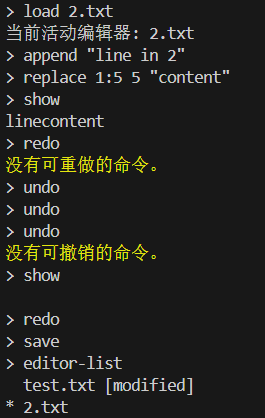
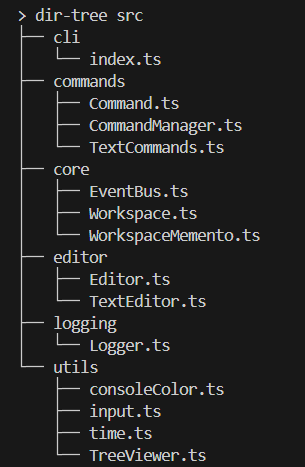
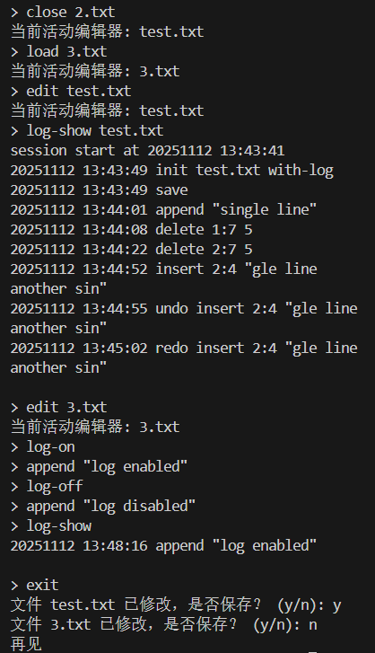

# 22302010009 冯伊然 文本编辑器

## 一、系统架构
### 1.1 模块划分图
  

### 1.2 模块职责说明
#### 1.2.1 EventBus
订阅和发布消息。各模块可以在EventBus上通过on()注册某个Event的处理器，或者通过emit()将事件发布给对其感兴趣的模块。  

重要接口:
- on(event: Event, handler: function): void  
  订阅某个事件，并指定得到通知时的处理方法  
- off(event: Event, handler: function): void  
  取消订阅某个事件  
- emit(event: Event, payload: any): void  
  发布某个事件，并附带事件信息  

#### 1.2.2 Command、TextCommands.ts
接口定义，指定命令的操作以及发布事件时的信息。  
TextCommands.ts（AppendCommand、DeleteCommand、ReplaceCommand、InsertCommand）为Command的实现，用于TextEditor的4个命令。  
（注：show命令因为不计入撤销栈，被视为伪命令，不作为需要new Command()的类对象处理）  

重要接口：  
- execute(editor: Editor): void  
  执行本命令，也用于redo  
- undo(editor: Editor): void  
  撤销本命令  
- toLog(): string  
  将命令信息转换为字符串，用于打印日志  

#### 1.2.3 CommandManager
用于管理命令的执行、撤销、重做。  

重要接口:  
- canUndo(): boolean  
- canRedo(): boolean  
  是否能够撤销/重做  
- execute(cmd: Command): void  
  执行某个命令并加入撤销栈  
- undo(): Command | null  
  撤销撤销栈顶的命令（如果有），加入重做栈并将其返回  
- redo(): Command | null  
  重做重做栈顶的命令（如果有），加入撤销栈并将其返回  

#### 1.2.4 Editor
表示编辑器文件的抽象类（为之后支持别的文件格式做准备），记录编辑器文件信息并提供执行命令、保存、获取信息的接口。  

重要接口:  
- executeCommand(cmd: Command): void  
- undoCommand(): void  
- redoCommand(): void  
  执行、撤销和重做命令，内部由CommandManager管理  
- abstract save(): void  
  保存编辑器文件  
- abstract getContent(): string  
  获取编辑器文件内容，用于展示  

#### 1.2.5 TextEditor
Editor的实现类，用于表示和编辑文本文件（.txt）。  

重要接口:  
- static create(path: string, eventBus: EventBus): TextEditor  
  读取指定目录的文件（如果没有则创建modified=true的新文件）并构造TextEditor
- appendLine(line: string): void  
  追加一行  
- deleteLastLine(): void  
  删除最后一行  
- insertAt(line: number, col: number, text: string): void  
  在指定位置插入文本（允许新增行）  
- deleteAt(line: number, col: number, length: number): void  
  删除指定位置指定长度的文本（不允许跨行）  
- setContent(lines: string[]): void  
  设置文件内容，用于insert和delete的撤销  

#### 1.2.6 Logger
通过EventBus监听命令执行、文本编辑等操作，写入日志（如果该编辑器文件的日志开关为真）。  

重要接口（其中事件处理函数注册在EventBus上）:  
- onEditorStart({ editorInfo: EditorInfo, log: string }): void  
  监听编辑器会话开始的事件，并写日志  
- onCommandExecute({ editorInfo: EditorInfo, log: string }): void  
  监听各类命令的执行，并写日志  
- showLog(srcPath: string): void  
  显示指定文件的.filename.log内容  

#### 1.2.7 WorkspaceMemento
保存和恢复工作区状态（type WorkspaceState）的备忘录类。  

重要接口:  
- constructor(state: WorkspaceState)  
  创建备忘  
- getState(): WorkspaceState  
  获取备忘的工作区状态  
- save(): void  
  将工作区状态保存到.editor_workspace  
- static load(): WorkspaceMemento | null  
  读取.editor_workspace并返回备忘（如果有）  

#### 1.2.8 Workspace
核心控制类。协调Command与Editor的交互，统筹管理命令处理、事件发布、状态管理等。  

重要接口（即**全部18个命令的入口**）:  
- load(file: string): void  
  加载文件  
- save(file: string | undefined): void  
  保存文件  
- init(file: string, withLog: boolean): void  
  创建新缓冲区  
- close(file: string | undefined): Promise&lt;void&gt;  
  关闭文件  
- edit(file: string): void  
  切换活动文件  
- editorList(): void  
  显示文件列表  
- dirTree(path: string): void  
  显示目录列表  
- undo(): void  
  撤销  
- redo(): void  
  重做  
- exit(): Promise&lt;void&gt;  
  退出程序  
- logOn(file: string | undefined): void  
  启用日志  
- logOff(file: string | undefined): void  
  关闭日志  
- logShow(file: string | undefined): void  
  显示日志  
- editorCommand(cmd: string, ...args: string[]): void
  执行TextEditor命令（append、delete、insert、replace、show）  

注: 以上close和exit是async函数，因为执行过程中需要确认是否保存文件，用到readline。  

#### 1.2.9 其他辅助类/函数
- CLI (index.ts): 循环读取输入、处理转义字符（"\n"），然后交给Workspace处理。  
- TreeViewer: 打印目录树。实现中采用了通用的展示树SimpleTreeViewer，以备日后展示其他内容。  
- input.ts: 提供全局的单例输入rl: readline.Interface，类似于console系列。  
- time.ts: 格式化日志所需的时间戳。  
- consoleColor.ts: 给控制台输出加一个漂亮的文本颜色，以便用户查看。  

### 1.3 模块依赖关系
#### 1.3.1 项目内部依赖
可以参考1.1 模块划分图。  
**总体结构**: 围绕Workspace展开，由Editor/TextEditor具体实现文件编辑，由Command/CommandManager执行文件编辑，通过EventBus向Logger发出日志信号。  

主要模块的自顶向下依赖关系:  
1. CLI  
- 入口模块，调用Workspace来执行命令  
- 依赖单例readline.Interface  

2. Workspace的依赖:  
- WorkspaceMemento: 保存与恢复工作区状态  
- Editor/TextEditor: 管理、编辑文件  
- EventBus: 发布事件通知  
- (工具类如TreeViewer 展示目录结构)  

3. Editor/TextEditor的依赖:  
- CommandManager: 执行命令（interface Command）  
- Command与其实现类: 定义命令操作  
- EventBus: 发布事件通知  

4. Logger的依赖:  
- EventBus: 监听事件通知以便记录日志  

#### 1.3.2 第三方依赖管理
除NodeJS自带模块外，本项目只用到几个简单的工具类外部依赖，以及运行、测试工具。
- jest: 自动化测试  
- ts-node: 运行TypeScript
- stringArgv: 解析输入参数  
- chalk: 命令行文本颜色  

## 二、核心设计
### 2.1 设计模式应用说明
#### 2.1.1 事件通知机制与日志：发布-订阅模式（增强的观察者模式）
**发布-订阅模式**是**观察者模式**的升级版，类似于观察者模式中观察者在被观察者上注册、被观察者状态改变时通知观察者。  
与传统的观察者模式不同的是，发布-订阅模式引入一条**事件总线**，观察者和被观察者不需要知道彼此的存在，只需要关心消息本身，实现了**观察者与被观察者的解耦**。  

本Lab中对该模式的应用：Workspace与Editor通过事件总线EventBus发布消息，Logger在事件总线上注册事件处理器（订阅），EventBus上有消息时通知Logger处理该消息。  

#### 2.1.2 工作区状态持久化与恢复：备忘录模式
备忘录模式保存对象（在这里是Workspace）的状态，以便日后恢复其状态。  
本Lab中对该模式的应用：Workspace将状态（type WorkspaceState）存入WorkspaceMemento中，然后该备忘被持久化到文件。再次启动编辑器时，从本地读取文件并反序列化为WorkspaceMemento，然后从中恢复状态。  

#### 2.1.3 指令执行、撤销与重做：命令模式
命令模式将不同的指令封装成一个对象，能存储指令所需参数和中间结果、保存和撤销命令等。执行命令时只需要依赖Command接口，而不需要依赖具体的命令，符合**依赖倒置**原则，降低了命令与执行对象的耦合。  

本Lab中对该模式的应用：实现文本编辑器的append、insert、delete、replace命令时，继承一个通用的interface Command接口，实现具体的操作。执行命令时创建命令对象并送至CommandManager，进入撤销栈管理。  

#### 2.1.4 编辑器的格式类型：装饰器模式
本Lab中，考虑到日后可能需要支持更多文件格式，Workspace依赖的是Editor，由TextEditor实现Editor并增加新的功能，体现了装饰器模式。  

#### 2.1.5 目录树的展示：适配器模式、访问者模式等
dir-tree指令展示目录树，考虑到之后可能还需要展示不同的树如XML结构树，本Lab中实现了通用的树形结构展示类，综合运用了多种设计模式。  
- 适配器模式: NameProvider和TreeContentProvider抽象接口（被FileNameProvider和DirTreeProvider实现）将不能直接展示的File等其它类型转换为用于展示的节点和字符串，体现了适配器模式。实际上，通过Provider对象而不是写死的算法来提供展示方式，也体现了策略模式。  
- 访问者模式: 定义Visitor来指定访问节点的函数，体现了访问者模式。  

#### 2.1.6 用户输入读取：单例模式
单例模式提供一个全局唯一的静态实例。JavaScript中常用的控制台输出console.log便属于此类。  
本Lab中对该模式的应用：创建一个全局共享的const rl: readline.Interface，主要用于index.ts中循环处理输入，但由于Workspace的exit和close时需要确认是否保存文件，这时就需要共用这个rl。单例模式使得不同的地方能方便地共用一个process.stdin，不会产生冲突。  

### 2.2 其他设计相关说明
关于编辑器的信息（是否启用日志、是否已修改、文件路径等），封装成一个interface EditorInfo类型。考虑到不同的编辑器都有不同的EditorInfo，并且编辑器执行命令时也需要对其修改，这里将其放在Editor而不是Workspace中管理，而Workspace需要它时（save指令）从Editor中获取。CommandManager也是这样，因为每个Editor有不同的撤销栈。  
这也降低了Workspace的压力和耦合度，避免一个大而全的“上帝对象”承担太多不必属于它的任务。  

## 三、运行说明
### 3.1 使⽤的编程语⾔及版本
TypeScript ES7, NodeJS v18+
### 3.2 安装依赖的步骤
1. 安装最新版的NodeJS  
2. 在项目根目录下，执行npm install，等待下载完成  
### 3.3 运行程序的命令
在项目根目录下，执行npm start  
### 3.4 运行测试的命令
在项目根目录下，执行npm test，测试完成后将打印结果  

## 四、测试文档
### 4.1 测试用例列表
共8组测试套件，从底层的EventBus、CommandManager、WorkspaceMemento到中间层的Logger、TextEditor、TextCommands，到最终集成各模块的Workspace，以及工具类TreeViewer逐个进行测试。  
测试工具为Jest，通过Mock隔离组件。 

1. TreeViewer  
- 打印目录树形结构  

2. EventBus  
- 注册并发出事件  
- 同一事件注册多个处理器  
- 取消事件注册  

3. CommandManager  
- 执行命令并加到撤销栈  
- 撤销命令并加到重做栈  
- 重做命令并加到撤销栈  
- 清理撤销栈和重做栈  
- 命令抛异常时处理错误  

4. WorkspaceMemento  
- 存储状态并序列化/将状态字符串反序列化  
- 存储和加载.editor_workspace  

5. Logger  
- 打开编辑器时写日志  
- 执行命令时写日志  
- 展示日志内容  
- 展示不存在的日志时警告  
- 日志开关未打开时不写日志  

6. TextEditor  
- 设置文件内容  
- 追加一行  
- 删除最后一行  
- 在指定位置插入  
- 在指定位置删除  
- 插入在非法位置时抛异常  
- 删除在非法位置时抛异常  
- 在文件末尾插入  
- 插入多行文本  
- 在空文件中插入非1:1位置  
- 保存文件并通知事件  

7. TextCommands  
- append命令执行和撤销  
- insert命令执行和撤销  
- delete命令执行和撤销  
- replace命令执行和撤销  
- 撤销和重做  
- 多次撤销  
- 撤销栈为空时不允许撤销  

8. Workspace  
- load创建新Editor并设为active  
- 多次load不重复创建  
- save指令  
- close时询问是否保存  
- undo和redo命令  
- log-on和log-off命令  
- 对editor执行命令  

### 4.2 测试执行结果
自动化测试全部通过，测试报告如下。  

## 五、运行截图
以下是程序实际运行截图。五张图分别展示了:  
- 程序启动、init命令、append delete insert show命令  
- load save editor-list命令、replace命令、undo redo命令  
- dir-tree命令  
- edit close exit命令、log-on log-off log-show命令  
- 再次启动时，工作区状态被恢复  

